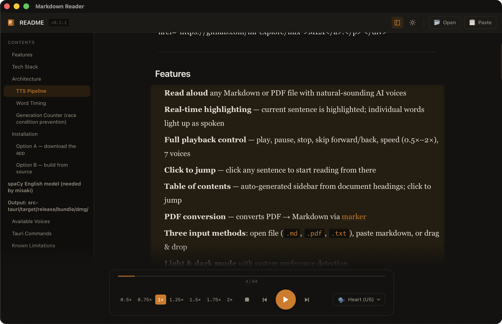

<div align="center">
  
  <h1>Markdown Reader</h1>
  <p>A native macOS app for reading Markdown and PDF files aloud with real-time text highlighting,<br>powered by <a href="https://huggingface.co/hexgrad/Kokoro-82M">Kokoro TTS</a> running locally on Apple Silicon via <a href="https://github.com/ml-explore/mlx">MLX</a>.</p>
</div>

<div align="center">
  
</div>

---

## Features

- **Read aloud** any Markdown or PDF file with natural-sounding AI voices
- **Real-time highlighting** — current sentence is highlighted; individual words light up as spoken
- **Full playback control** — play, pause, stop, skip forward/back, speed (0.5×–2×), 7 voices
- **Click to jump** — click any sentence to start reading from there
- **Table of contents** — auto-generated sidebar from document headings; click to jump
- **PDF conversion** — converts PDF → Markdown via [marker](https://github.com/datalab-to/marker)
- **Three input methods**: open file (`.md`, `.pdf`, `.txt`), paste markdown, or drag & drop
- **Light & dark mode** with system preference detection

## Tech Stack

| Layer | Technology |
|---|---|
| App shell | [Tauri 2](https://tauri.app) (Rust + WebView) |
| Frontend | React 18 + TypeScript + Vite + Tailwind CSS |
| TTS engine | [Kokoro-82M](https://huggingface.co/hexgrad/Kokoro-82M) via [mlx-audio](https://github.com/Blaizzy/mlx-audio) |
| ML runtime | [MLX](https://github.com/ml-explore/mlx) (Apple Silicon GPU/ANE) |
| PDF → MD | [marker-pdf](https://github.com/datalab-to/marker) |
| Text → phonemes | [misaki](https://github.com/hexgrad/misaki) + [espeak-ng](https://github.com/espeak-ng/espeak-ng) |
| Markdown rendering | [react-markdown](https://github.com/remarkjs/react-markdown) + remark-gfm |

## Architecture

```
markdown-reader/
├── src/                        # React frontend
│   ├── App.tsx                 # Root: document state, toolbar, theme
│   ├── components/
│   │   ├── WelcomeScreen.tsx   # Landing with Open / Paste actions
│   │   ├── PasteModal.tsx      # Inline markdown editor
│   │   ├── MarkdownViewer.tsx  # Rendered markdown + highlighting
│   │   ├── PlayerControls.tsx  # Bottom player bar
│   │   └── TableOfContents.tsx # Sidebar TOC
│   ├── hooks/
│   │   └── usePlayer.ts        # Player state machine + TTS queue
│   └── lib/
│       └── textSegmenter.ts    # Splits markdown into TTS segments
│
├── src-tauri/                  # Rust/Tauri backend
│   └── src/commands/
│       ├── tts.rs              # generate_speech, list_voices
│       └── files.rs            # read_file, convert_pdf
│
└── sidecar/                    # Python AI backends
    ├── tts_server.py           # Kokoro/MLX TTS sidecar (stdin/stdout JSON)
    └── pdf_converter.py        # marker-pdf PDF → Markdown
```

### TTS Pipeline

1. Markdown is split into sentence-level segments (`textSegmenter.ts`)
2. The React player (`usePlayer.ts`) sends each segment to Rust via `invoke("generate_speech", ...)`
3. The Rust command spawns `tts_server.py` with a JSON request on stdin
4. Python generates audio via Kokoro (MLX) and returns base64-encoded WAV + word-timing estimates on stdout
5. The frontend decodes the WAV, plays it via Web Audio API, and highlights words in sync

### Word Timing

Kokoro doesn't expose per-word timing natively. Word timings are estimated by weighting each word's duration proportional to its character count, with slight boosts for words ending in punctuation. This gives smooth-enough highlighting for most text.

### Generation Counter (race condition prevention)

Each "play session" has a unique monotonic generation number (`genRef`). All async callbacks (awaiting TTS, awaiting audio decode, `source.onended`) check the current generation before continuing. This prevents stale sessions from interfering when the user rapidly changes speed, skips, or stops.

## Installation

> **Requires:** macOS with Apple Silicon (M1/M2/M3). MLX does not run on Intel Macs.

### Option A — download the app

1. Download `Markdown.Reader_x.x.x_aarch64.dmg` from the [latest release](../../releases/latest)
2. Open the DMG and drag **Markdown Reader** to Applications
3. Run the one-time Python setup:
   ```bash
   curl -fsSL https://raw.githubusercontent.com/parmsam/markdown-reader/main/setup.sh | bash
   ```
4. Launch the app

**If macOS says "Markdown Reader is damaged and can't be opened"**

This is Gatekeeper blocking an unsigned download. Run once in Terminal, then relaunch:
```bash
xattr -dr com.apple.quarantine /Applications/Markdown\ Reader.app
```

### Option B — build from source

**Prerequisites**

```bash
brew install espeak-ng node
curl --proto '=https' --tlsv1.2 -sSf https://sh.rustup.rs | sh
```

**Python dependencies**

```bash
pip3 install mlx-audio misaki num2words phonemizer marker-pdf spacy

# spaCy English model (needed by misaki)
pip3 install \
  "https://github.com/explosion/spacy-models/releases/download/en_core_web_sm-3.8.0/en_core_web_sm-3.8.0-py3-none-any.whl"
```

**Run in dev mode**

```bash
npm install
npm run tauri dev
```

**Build a release DMG**

```bash
npm run tauri build
# Output: src-tauri/target/release/bundle/dmg/
```

**First-launch note:** The Kokoro model (~330 MB) is downloaded from HuggingFace on first use and MLX JIT-compiles the kernels. Expect ~30 s the first time; subsequent launches are fast.

## Available Voices

| ID | Name | Accent |
|---|---|---|
| `af_heart` | Heart | US English (F) |
| `af_nova` | Nova | US English (F) |
| `af_sky` | Sky | US English (F) |
| `am_adam` | Adam | US English (M) |
| `am_michael` | Michael | US English (M) |
| `bf_emma` | Emma | British English (F) |
| `bm_george` | George | British English (M) |

## Tauri Commands

| Command | Arguments | Returns |
|---|---|---|
| `generate_speech` | `text, voice, speed, segmentIndex` | `SpeechResult` (audio_b64, word_timings, duration) |
| `list_voices` | — | `VoiceInfo[]` |
| `read_file` | `path` | `String` (file contents) |
| `convert_pdf` | `path` | `String` (markdown) |

## Known Limitations

- Requires Apple Silicon Mac (MLX uses Metal GPU / ANE)
- Very short texts (< 3 words) get padded to avoid an MLX broadcast bug in Kokoro
- PDF conversion can be slow (30 s+) for large documents
- Word timing is estimated, not exact
